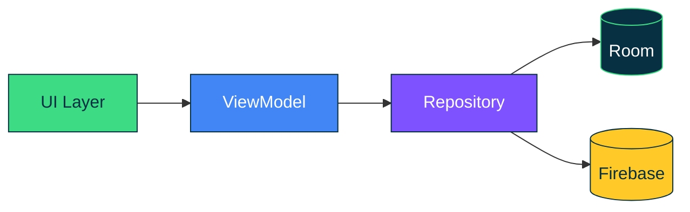

<div align="center">


<a href="https://saadev.site/">
  
</a>

<br/>

[](https://saadev.site/)
[](https://www.linkedin.com/in/muhammad-saad075/)
[](mailto:saaddevlabs@gmail.com)


<br/><br/>


</div>


## Hey, I'm Saad

I'm an Android developer with 2+ years of experience building native apps with Kotlin, Jetpack Compose and Firebase. I care about clean architecture, readable code, and apps that solve real problems for real people.

```kotlin
val saad = AndroidDeveloper(
    name = "Muhammad Saad",
    location = "Pakistan",
    languages = listOf("Kotlin", "Java", "Python", "JavaScript"),
    architecture = listOf("MVVM", "Clean Architecture"),
    backend = listOf("Firebase", "Cloud APIs"),
    currentlyLearning = listOf(
        "Advanced Compose animations",
        "Firebase scaling patterns",
        "Gemini API integration"
    ),
    funFact = "I build a full demo app for every new concept before it touches production code"
)
```


## What I'm Up To

<table>
  <tr>
    <td width="220"></td>
    <td>Native Android apps with Kotlin, Jetpack Compose and Firebase</td>
  </tr>
  <tr>
    <td></td>
    <td>Advanced Compose animations, Firebase scaling and Google Gemini AI</td>
  </tr>
  <tr>
    <td></td>
    <td>Android projects involving Firebase, Compose or AI (Gemini API)</td>
  </tr>
  <tr>
    <td></td>
    <td>Open source Android and Compose projects</td>
  </tr>
  <tr>
    <td></td>
    <td>Kotlin, Jetpack Compose, Firebase, MVVM and Clean Architecture</td>
  </tr>
</table>


## Featured Projects

<table>
  <tr>
    <td width="50%" valign="top">
      <h3>DevJournal</h3>
      <sub><b>ANDROID APP</b></sub>
      <br/><br/>
      A native developer journal and blog client built with Kotlin and Jetpack Compose. It shares a Firebase backend with a companion web admin panel.
      <br/><br/>
        
      <br/><br/>
      <a href="https://github.com/chsaad-dev/Dev-Journal-Android"><b>View on GitHub</b></a>
    </td>
    <td width="50%" valign="top">
      <h3>GiveEase</h3>
      <sub><b>FINAL YEAR PROJECT</b></sub>
      <br/><br/>
      A donation platform that connects donors with verified NGOs across Pakistan, with identity checks and admin review.
      <br/><br/>
        
      <br/><br/>
      <a href="https://github.com/chsaad-dev/GiveEase"><b>View on GitHub</b></a>
    </td>
  </tr>
  <tr>
    <td width="50%" valign="top">
      <h3>GupShup</h3>
      <sub><b>ANDROID APP</b></sub>
      <br/><br/>
      A feature rich messaging app with authentication, Firestore, local storage through Room and media handling with Cloudinary.
      <br/><br/>
         
      <br/><br/>
      <a href="https://github.com/chsaad-dev/GupShup"><b>View on GitHub</b></a>
    </td>
    <td width="50%" valign="top">
      <h3>NoteSync</h3>
      <sub><b>CROSS PLATFORM APP</b></sub>
      <br/><br/>
      An offline first notes app with cloud sync, built with Flutter, Riverpod, Isar and Firebase. Local data is encrypted at rest with AES 256.
      <br/><br/>
        
      <br/><br/>
      <a href="https://github.com/chsaad-dev/NoteSync"><b>View on GitHub</b></a>
    </td>
  </tr>
</table>

<div align="center">

**[See everything on my portfolio](https://saadev.site/)**

</div>


## How I Structure My Apps



UI observes state from the ViewModel, the ViewModel talks to a single Repository, and the Repository decides whether data comes from local storage or the cloud. Keeping those layers separate is what makes the apps testable and easy to grow.


## Tech Stack

<table>
  <tr>
    <td width="160"><b>Android</b></td>
    <td></td>
  </tr>
  <tr>
    <td><b>Backend and Cloud</b></td>
    <td></td>
  </tr>
  <tr>
    <td><b>Tools and Languages</b></td>
    <td></td>
  </tr>
</table>


## GitHub Stats

<div align="center">


</div>


## Let's Connect

Got an Android idea, a Compose or Firebase problem, or an open source project that needs a hand? Reach out.

<div align="center">

[](https://saadev.site/)
[](https://www.linkedin.com/in/muhammad-saad075/)
[](https://facebook.com/muhammadsaad075)
[](https://instagram.com/ch.saad381)
[](https://reddit.com/user/saaddevlabs)
[](mailto:saaddevlabs@gmail.com)


</div>
